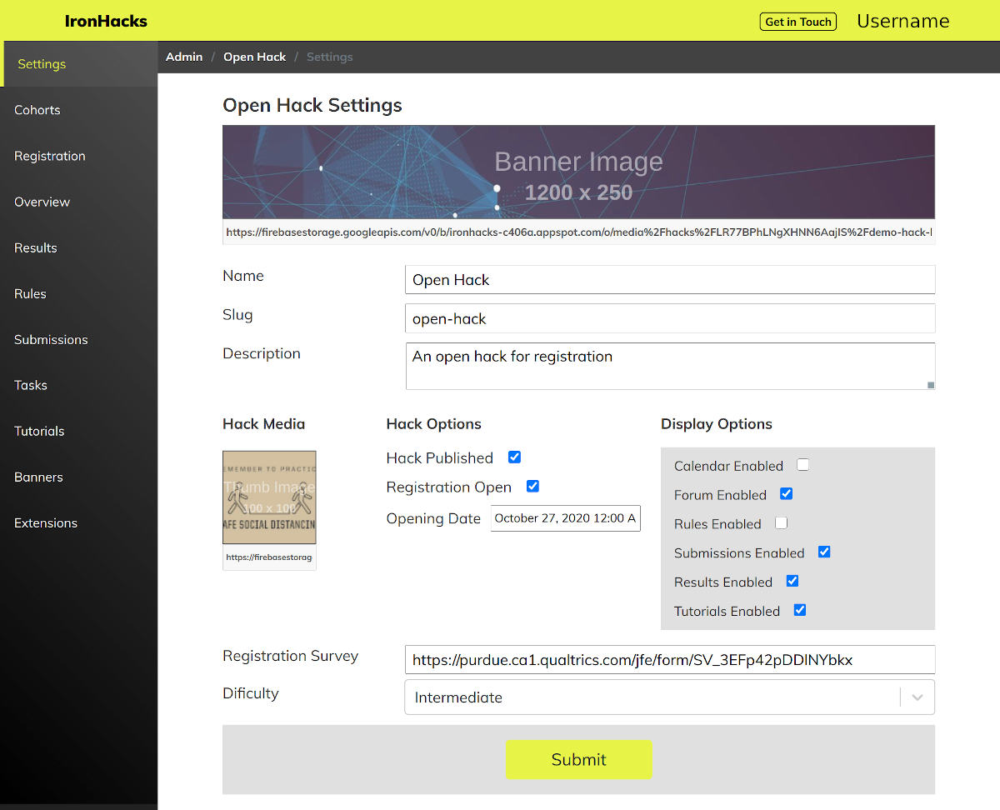

# Hack Admin

> Admin users must be manually added by a developer.

Platform admins can create and manage hacks from the administrator portal at `/admin`.

## Hack Settings

The hack settings page allows you to update content for a hack including

- name - The title of the hack
- slug - the hacks url path
- description - a brief description of the hack
- banner image - the image displayed at the top of the overview page
- thumbnail image - a small image displayed in the hack selection screen
- publish and unpublish - determines if the hack is visible in the selection screen
- registration open - manually sets the registration open or closed
- display options - sets which pages will be visible in the hack navigation
- registration survey - if this is filled in then participants will be required to fill in the survey when registering
- difficulty - sets the hack difficulty category

## Hack Content

Content for the hack can be added in several places in the admin area using the integrated markdown editor.

__Overview Page__

The hack overview page is the landing page for the hack. This content is also displayed on the hack registration page.

__Rules Page__

If `rules enabled` is checked in the hack display settings then the content here will be displayed on the rules page.

__Task Page__

The task page has a unique property that allows you create multiple task documents which can be shown to specific cohorts (managed in the cohort settings area). You should set the default task document if you do not intend to use this feature, which will be shown to any user not in a cohort or if that participants cohort does not have a set task.

Only one task can ever be shown to the participant.

Each task may enable the a survey url to be included before the task is viewable by the user (this must be manually enabled for each task).

To include the task page in the hack navigation area `task enabled` you must click `publish task` in the admin task editor view. This feature was created to help track the specific event timing between the start of the hack, registration, and when the task is made avaiable (when users can actually start working on their submission).

__Tutorials Page__

You can create multiple tutorials which will be displayed in the hack tutorials list.

## Hack User Cohorts

Cohorts allow participants to be segmented into different groups with additional features that can be enabled.

__Cohort Options__

- __*Cohort Task*__ - Each cohort can be assigned to a different task document (created in the admin tasks area).  If no cohort is assigned to a participant or if a task is not set for a certain cohort the default task is shown.

- __*Show Summaries*__ - If `show summaries` is enabled participants in this cohort will have access to the 'peers' tab in the results dashboard and will be shown the submission summary, and tags fields from other users in their cohort.

- __*Show Notebooks*__ - If `show notebooks` is enabled participants in this cohort will have access to the 'peers' tab in the results dashboard and will be shown links to view the notebook files submitted by other users in their cohort.

__Assigning Cohorts__

There is no limit to the number of cohort groups.

New cohorts can be created by selecting the `add cohort` button and the save button. If a new cohort is created after assigning users to cohorts, there will be no participants assigned to this cohort and you may need reassign groups or manually assign them in the database.

Cohorts can be deleted by selecting the `delete cohort` button and the save button.  If a cohort is deleted after assigning users to cohorts, these participants will become unassigned. *Doing this may lead to unintended effects.*

Participants should only be assigned to cohorts once. The best time to do this is after registration for the hack is closed.

To assign users to cohorts select the `assign users` button at the bottom of the admin cohorts area. This will randomly assign all non-admin participants to a cohort. A list of user id's assigned to each cohort are displayed below the cohort settings section.

## Hack Submissions

Submissions have the following properties:

- name - the displayed name of the submission
- submission id - the id of the submission used in the database and url paths
- deadline - after this time the submission will be closed
- description - content written in markdown used to describe the background and requirements of the submission
- survey url - if this field is set the linked survey will be shown when the user hits the submit button
- submission options
    - submission summary - if this is checked a text summary text field is added to the submission form
    - submission tags - if this is checked an additional multi-select field will be included with a list of tags
- additional fields - each field created adds an additional question and text input field to the submission.  Each field can optionally be set as required.
- submission files - each file field added to the submission sets the filename and extension that is allowed to be uploaded in the submission form. File fields may optionally be set as required.
- submission enabled - submissions must be set to `enabled` to be active. If the submission is not enabled, they will be present in the submission list but participants will not be able to use the form or upload files.
- solution file - each submission accepts a single file attachment for internal use only to be used in the scoring process. Currently this is used for file management and retrieval purposes only.

## Hack Results

__Results Dashboard Document__

The results page features a single markdown editor that can be used to display information about the results area below the scores section of the results dashboard. Information about the scoring processes or detailed information about how certain metrics are created are typically shown along with the scores.

__Submission Results Editor__

Every submission created has an entry in the admin results area which also shows if that result set has been published yet. Submission scores are computed outside of the platform and uploaded via the results editor. In the results editor area admin users can paste the submission results set into the field, validate the content (checks for syntax errors only), and save the results to the database.

After the results are saved, they can be downloaded again by hitting the download button and the stats button downloads a summary statistics report.

Results saved in the admin results editor are not displayed in the participant dashboard until they are published by hitting the "Publish Results". This is intended to allow for work in progress and checking for correctness before they are seen by the users.
