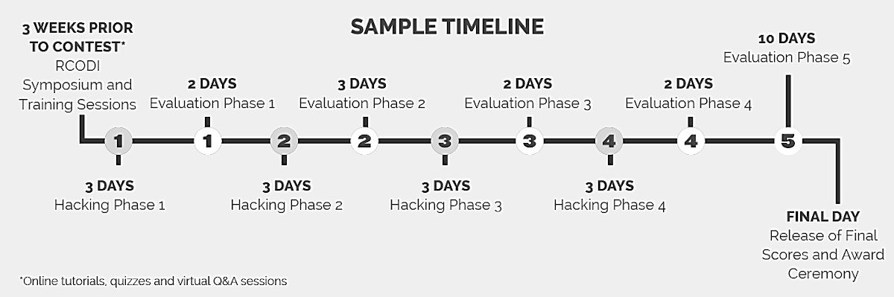

# Hacks

Hacks are the main activity on the IronHacks platform.

## Hack Process

A Hack is a an iterative multiphase process, where competing participants have access to tutorials, standardized libraries and packages, and virtual help sessions. After each phase, submissions are evaluated with the help of machine intelligence and human experts.

