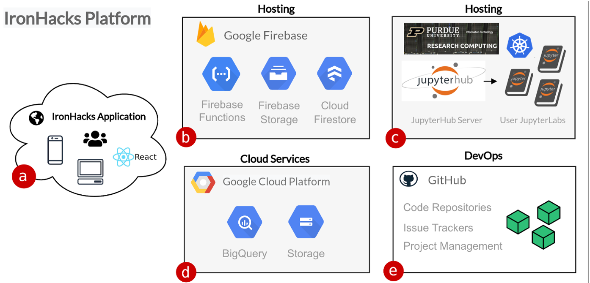

# Platform Overview

IronHacks is a cloud-based data science platform developed by the RCODI team.

The IronHacks application (a) is written in React. The application is hosted on Google Firebase (b) which also provides cloud file storage, the application database, and serverless functions used by services outside the platform that interact with the IronHacks database.

A second server hosted on Geddes (c) provides the JupyterHub/JupyterLab web-based notebook service used by participants which includes GPU.

Data used in the hack requires special consideration due to both technical and licensing issues. Google Cloud Platform services (d) are used to store very large datasets and to provide a secure API that the participants can access the challenge data directly in the hosted notebook environment.

The team uses GitHub (e) for version control, issue tracking, and project management.

## Platform Features

Key platform features include:-

- A cloud-based data science workspace to perform data science tasks in the cloud using Juptyer notebooks
- Event specific announcement banners
- Markdown document editor for challenge task description, rules, and tutorials
- Participant file and form submission tool
- Event forum with email notification system for new posts
- Markdown click tracking for analytics
- Submission scoring tools
- Results management system including downloadable reports
- Notes feature for admins to keep track of issues
- Example features for experimental setups
- Interactive results dashboard
- Jupyter notebook web viewer to view submissions or example files directly in the app
- Integration with Qualtrics surveys

## Platform Users

Users on the platform can be one of two types.

- Participants
- Administrators

*Participants* register for hacks, comment on forum posts, work on tasks in the workspace, submit files, and view the results dashboard.

*Admin* users are able to create/setup hacks, create submissions, create forum posts, edit tasks and tutorials, and manage the results dashboard.
